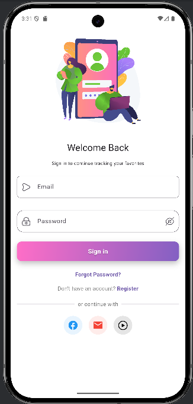
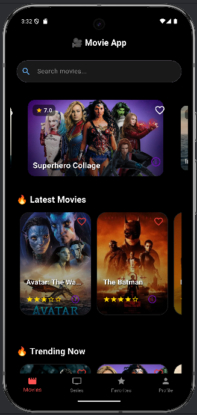
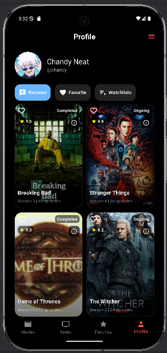

# Movie App 🎬

A modern, user-friendly movie browsing and profile management app built with Flutter and GetX. The app allows users to explore movies, edit their profiles, and customize the app's appearance with light and dark themes.


## 📋 Table of Contents
- [Features](#features)
- [Screenshots](#screenshots)
- [Installation](#installation)
- [Usage](#usage)
- [Project Structure](#project-structure)
- [Contributing](#contributing)
- [License](#license)
- [Contact](#contact)

## ✨ Features
- **Movie Screen**: Explore a curated list of movies, Tranding movies and Latest movies.key feature: [search, filter, View Detail, click favorite].
- **Series screen**: Explore a curated list of movies with episode, season, rate star. Key feature: [search, filter, click add to favorite, ].
- **Favorite screen**: Explore a curated list of movies with episode, season, rate star. Key feature: [search, filter, click Unadd to favorite,view detail ].
- **Profile Management**: Edit user profiles with name, email, password, and profile image.
- **Theme Customization**: Toggle between light and dark themes for a personalized experience.
- **Responsive Design**: Optimized for various screen sizes with a modern UI (gradients, rounded cards).
- **GetX Architecture**: Efficient state management, navigation, and dependency injection.
## 📸 Screenshots
| Edit Profile | Settings | Profile |
|--------------|----------|----------|
|  |  |  |

*Note*: Replace placeholder images with actual screenshots of your app.

## 🛠 Installation
Follow these steps to set up the Movie App locally.

### Prerequisites
- [Flutter](https://flutter.dev/docs/get-started/install) (version 3.24.1 or later)
- [Dart](https://dart.dev/get-dart)
- A code editor (e.g., VS Code, Android Studio)
- Git

### Steps
1. **Clone the Repository**:
   ```bash
   https://github.com/Dyy-Coding/Movie_series_tracking.git
   cd movie-app
   ```

2. **Install Dependencies**:
   ```bash
   flutter pub get
   ```

3. **Run the App**:
   ```bash
   flutter run
   ```

4. **Optional**: For theme persistence, add `shared_preferences` to `pubspec.yaml`:
   ```yaml
   dependencies:
     shared_preferences: ^2.0.15
   ```

## 🚀 Usage
1. **Launch the App**: Run `flutter run` to start the app on an emulator or device.
2. **Onboarding**: Complete the onboarding flow to access the main features.
3. **Edit Profile**:
   - Navigate to the login or register screen (`/login`) / (`/register`).
   - Update name, email, password, and profile image.
4. **Settings**:
   - Go to the movies screen (`/movies`).
5. **Explore Movies**: (TBD: Add movie browsing instructions once implemented.)

## 📁 Project Structure

```plaintext
movie_app/
├── lib/
│   ├── app/
│   │   ├── common/
│   │   ├── data/
│   │   ├── modules/
│   │   │   ├── authentication/
│   │   │   ├── favorite/
│   │   │   ├── movies/
│   │   │   ├── profiles/
│   │   │   └── seriesscreen/
│   │   ├── routes/
│   │   ├── services/
│   │   └── utils/
│   │       └── constants/
│   └── main.dart
└── README.md

## 📬 Contact
- **Maintainer**: Chandy Neat
- **Email**: chandy.neat@student.passerellesnumeriques.org
- **GitHub**: Dyy-Coding(https://github.com/Dyy-Coding)
---

*Built with 💙 using Flutter and GetX.*